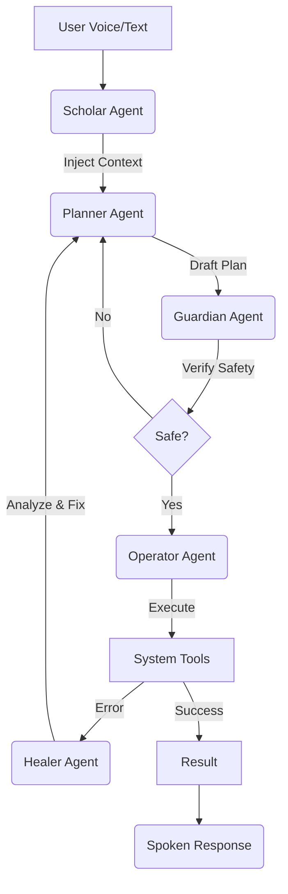

# 🤖 SG_CUBE — Local-First AI Operating System

[](https://www.python.org/downloads/)
[](https://www.microsoft.com/windows)
[](https://ollama.com/)
[](https://textual.textualize.io/)

**SG_CUBE** is a voice-first, vision-aware, and highly integrated AI assistant designed to run entirely on your local machine. It transforms your computer into an "AI Operating System" that can see what you see, remember what you've done, and execute complex system commands via voice or text.

---

## 📖 Table of Contents
- [📟 Immersive Terminal UI](#-the-immersive-terminal-ui)
- [🚀 Core Capabilities](#-core-capabilities)
- [🛠️ Tool Catalog](#-tool-catalog)
- [🧠 Multi-Agent Architecture](#-multi-agent-architecture)
- [🔐 Local-First Philosophy](#-local-first-philosophy)
- [📦 Quick Start](#-quick-start)
- [🏃 Usage](#-usage)

---

## 📟 The Immersive Terminal UI

SG_CUBE features a custom-built **Sci-Fi Terminal Interface** (TUI) that feels like it's pulled straight from a hacker's workstation. 

### 🔵 Aesthetic: Sci-Fi Cyan (#00d4ff)

```text
  ███████╗ ██████╗      ██████╗██╗   ██╗██████╗ ███████╗
  ██╔════╝██╔════╝     ██╔════╝██║   ██║██╔══██╗██╔════╝
  ███████╗██║  ███╗    ██║     ██║   ██║██████╔╝█████╗  
  ╚════██║██║   ██║    ██║     ██║   ██║██╔══██╗██╔════╝
  ███████║╚██████╔╝    ╚██████╗╚██████╔╝██████╔╝███████╗
  ╚══════╝ ╚═════╝      ╚═════╝ ╚═════╝ ╚═════╝ ╚══════╝
[  M U L T I - A G E N T   A I   O S   ·   v1.0.0-AGENTIC  ]

┌────────────────────────────────────────────────────────────┐
│ * SYSTEM ONLINE           14:20:05        STATUS : LISTENING │
└────────────────────────────────────────────────────────────┘

┌─ ENGINES ──────────────────┐  ┌─ TRANSCRIPT ───────────────┐
│ * vosk    * whisper        │  │ > Summarize the open PDF   │
│ * ollama  * piper          │  │   and send it to my email. │
│ . ALL READY                │  │                            │
└────────────────────────────┘  └────────────────────────────┘
┌─ ROUTING (session) ────────┐  ┌─ INTENT ───────────────────┐
│ cache ███░░░░░ 40%         │  │ summarize / ieee_paper.pdf │
│ rule  ██████░░ 80%         │  │ (LLM_LAYER)                │
│ llm   █░░░░░░░ 20%         │  │                            │
└────────────────────────────┘  └────────────────────────────┘
┌─ RECENT ───────────────────┐  ┌─ EXECUTION ────────────────┐
│ [v] open spotify     rule  │  │ [v] PDF analyzed correctly.│
│ [v] set volume 50    rule  │  │ [!] RUNNING (comms.email)  │
│ [x] find keys        llm   │  │                            │
└────────────────────────────┘  └────────────────────────────┘
┌─ RELIABILITY ──────────────┐
│ TOOL    ██████████░ 95%    │
│ AI      ████████░░░ 82%    │
│ CONTEXT ███████████ 100%   │
└────────────────────────────┘

┌────────────────────────────────────────────────────────────┐
│ LIVE MIC  | ▓▓▓▓▓▓▓▓▓▓▓▓▓▓▓▓▓▓▓▓▓▓▓▓▓▓▓▓▓▓▓▓▓▓▓▓▓▓▓▓▓▓▓▓▓▓  │
└────────────────────────────────────────────────────────────┘
```

*   **📡 Live Telemetry:** Real-time visualization of mic levels, confidence scores, and multi-agent "thinking" states.
*   **⚡ Smart Routing:** Watch as the system routes your intent through Cache → Rules → LLM in real-time.
*   **👻 Pop-on-Wake:** The UI automatically minimizes when idle and "pops up" the moment you say "Onyx", keeping your workspace clean.
*   **🛠️ Self-Healing HUD:** Monitor the "Healer" agent as it automatically recovers from tool execution errors.

---

## 🚀 Core Capabilities

### 🎙️ Voice-First Interaction
Hands-free control with local Wake-Word detection ("Onyx"), high-accuracy STT (**faster-whisper**), and natural neural TTS (**Piper**). No data ever leaves your mic to the cloud.

### 👁️ Vision-RAG (Screen Awareness)
A dedicated vision loop that periodically captures and analyzes your screen using local VLMs (like **Qwen2.5-VL**). 
*   **🧠 Smart Change Detection:** Efficiently skips redundant analysis if the screen hasn't changed, saving VRAM and CPU.
*   **⚡ Instant Context Recall:** Quickly retrieves the latest visual observation to answer "What was I just looking at?".
*   **🔍 Situational Awareness:** Understands code errors, charts, or browser content in real-time.

### 🧠 Semantic Long-Term Memory
Powered by **ChromaDB**, the system maintains an episodic and semantic memory. It remembers facts, user preferences, and past interactions to provide deeply personalized context.

---

## 🛠️ Tool Catalog

SG_CUBE comes packed with native tools for deep system integration:

| Category | Capabilities |
| :--- | :--- |
| **🖥️ System Control** | Volume, Brightness, Power, Battery info, Screen capture, Window management |
| **📁 File Operations** | Search, Read, Write, Organize files, Folder summaries |
| **🌐 Information** | Local Weather, News RSS, Crypto/Stock prices, Wikipedia search |
| **🎥 Media & Comms** | YouTube search/play, Email drafts, Calendar reminders, Notes management |
| **🧠 Intelligence** | PDF/Web Summarization, OCR (Text from image), Real-time Translation |
| **💻 Dev Tools** | Code explanation, Sandbox execution, System info diagnostics |

---

## 🧠 Multi-Agent Architecture

SG_CUBE uses a sophisticated multi-agent orchestration layer to ensure safety and reliability.



1.  **Scholar:** Injects relevant memories (long-term facts + recent visual observations) into the context.
2.  **Planner:** Devises a multi-step strategy using system tools.
3.  **Guardian:** Verifies the plan for security and ensures parameters match the tool schema.
4.  **Operator:** Executes the tools in a safe, controlled environment.
5.  **Self-Healer:** If a tool fails, the Healer analyzes the traceback and prompts a correction.

---

## 🔐 Local-First Philosophy

Unlike cloud-based assistants, SG_CUBE is built on the **Local-First** principle:

*   **Privacy by Design:** Your voice, screen, and data never leave your hardware. No telemetry, no training on your private files.
*   **Zero Latency:** No "processing..." spinning wheels caused by slow internet. Local STT and LLMs respond instantly.
*   **Offline Reliability:** Works in a bunker, on a plane, or during an internet outage.
*   **Full Ownership:** You own the models, you own the memory, you own the OS.

---

## 🛠️ Tech Stack

| Layer | Technology |
|---|---|
| **API Server** | FastAPI (Python 3.12) |
| **LLM Runtime** | Ollama (Local) |
| **STT Engine** | faster-whisper (Local) |
| **TTS Engine** | Piper (Local Neural TTS) |
| **Wake-Word** | Vosk |
| **Vector DB** | ChromaDB |
| **UI Framework** | Textual (TUI) |

---

## 📦 Quick Start

### 1. Prerequisites
- **Python 3.12+**
- **Ollama:** [Download Ollama](https://ollama.com/).
- **Tesseract OCR:** Required for vision features. [Download Tesseract](https://github.com/UB-Mannheim/tesseract/wiki).

### 2. Prepare Local Models
```bash
ollama pull gemma2:2b       # Default tool-calling agent
ollama pull qwen2.5-vl      # Vision model
ollama pull nomic-embed-text # Embedding model
```

### 3. Installation
```bash
# Clone and setup environment
git clone https://github.com/your-repo/sg_cube.git
cd sg_cube
python -m venv .venv
source .venv/bin/activate  # Windows: .venv\Scripts\activate

# Install dependencies
pip install -r requirements.txt

# Download offline models
python tools/download_vosk_model.py
python tools/download_piper_voice.py
```

---

## 🏃 Usage

### Start the AI OS
This launches the always-on background listener and the immersive Terminal UI:
```bash
python -m backend.daemon.main --ui terminal
```

### Pro Tips
- **Wake Word:** Say `"Onyx"` followed by your command.
- **Clipboard:** SG_CUBE monitors your clipboard for context-aware actions.
- **Vision:** The system "glances" at your screen periodically to build visual context.

---

<!-- Generated by SG_CUBE Documentation Tool -->
