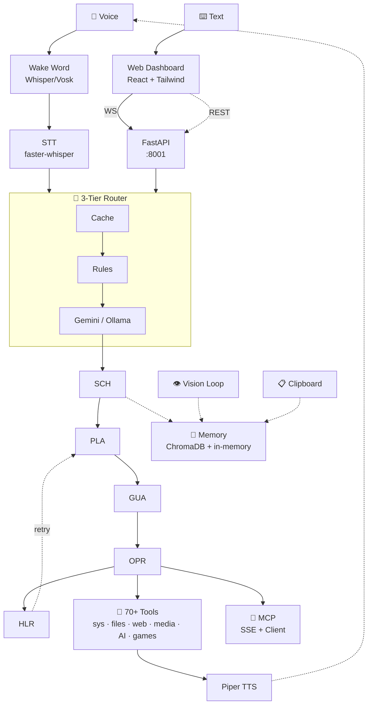
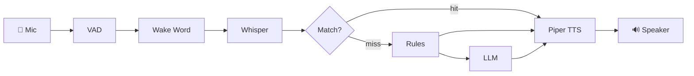
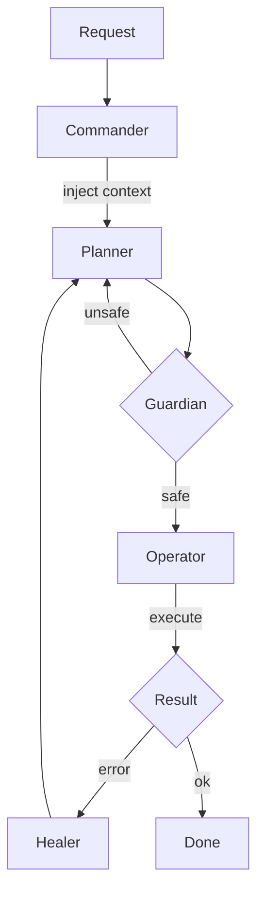

<p align="center">
  
  
  
  
  
  
  
  
  
  
</p>

<h1 align="center">
  ⬡ SG CUBE ⬢
</h1>

<h3 align="center">
  <i>local-first · voice-first · vision-aware</i>
</h3>

<p align="center">
  <b>Your AI assistant that sees your screen, hears your voice, remembers everything — cloud-powered agent, local privacy for voice &amp; vision.</b>
</p>

<br/>

---

<br/>

## ▸ System Architecture



---

## ▸ Voice Pipeline



---

## ▸ Agent Pipeline



---

## ▸ Features

| Layer | Stack | Status |
|-------|-------|--------|
| **Wake Word** | Whisper (int16→float32) / Vosk | ✅ |
| **Speech-to-Text** | faster-whisper + silero-VAD | ✅ |
| **Text-to-Speech** | Piper neural TTS | ✅ |
| **Voice Pipeline** | Local (default) or LiveKit streaming | ✅ |
| **Intent Routing** | 3-tier: Cache → Regex Rules (~40) → LLM | ✅ |
| **Agent LLM** | Gemini 2.5 Flash (cloud) / Ollama (local fallback) | ✅ |
| **Intent Classifier** | Ollama — phi3 (local, lightweight) | ✅ |
| **Vision** | Periodic screen capture + Qwen2.5-VL | ✅ |
| **Memory** | ChromaDB (long-term/episodic) + in-memory (short-term/timeline/screen) | ✅ |
| **Agent Pipeline** | Commander → Planner → Guardian → Operator → Healer | ✅ |
| **Tool System** | 70+ built-in tools (system, files, web, media, AI, games) | ✅ |
| **Games** | Blackjack · Hangman · Wordle · TicTacToe · Connect4 · RPS | ✅ |
| **MCP Protocol** | FastMCP SSE server + external MCP client | ✅ |
| **Observability** | Reliability metrics · tool-usage heatmap · agent telemetry | ✅ |
| **Plugins** | Auto-discovered from `backend/plugins/` | ✅ |
| **Auth** | Supabase JWT (optional — local mode works without it) | ✅ |
| **Frontend** | React 19 · TypeScript 6 · Vite · Tailwind · shadcn/ui · Framer Motion · Zustand | ✅ |

> WebSocket live feed of agent state, mic levels, routing decisions, and memory queries served to the dashboard in real-time.

---

## ▸ Quick Start

### Prerequisites

| Tool | Link |
|------|------|
| **Python 3.12+** | [python.org](https://python.org) |
| **Ollama** | [ollama.com](https://ollama.com) |
| **Tesseract OCR** | [UB-Mannheim/tesseract](https://github.com/UB-Mannheim/tesseract/wiki) |

### Setup

```bash
# 1. Pull local models (intent classifier + embeddings + vision)
ollama pull phi3
ollama pull qwen2.5vl:3b
ollama pull nomic-embed-text

# 2. Python environment
python -m venv .venv
.venv\Scripts\activate
pip install -r requirements.txt

# 3. Download offline voice models
python tools/download_vosk_model.py
python tools/download_piper_voice.py

# 4. Configure
copy .env.example .env
# Set GEMINI_API_KEY in .env (get one at https://aistudio.google.com/apikey)
```

### Run

```bash
# Terminal 1 — Backend API server
python -m uvicorn backend.server.main:app --host 127.0.0.1 --port 8001

# Terminal 2 — Frontend dev server
cd frontend
npm install
npm run dev
```

Open **http://localhost:5173** — API at `http://127.0.0.1:8001`.

> **PowerShell users:** type `.\sg_cube` instead of `sg_cube`.

### Production Build

```bash
cd frontend && npm run build
python -m uvicorn backend.server.main:app --host 0.0.0.0 --port 8001   # auto-serves built frontend
```

---

## ▸ Configuration

| Variable | Default | Purpose |
|----------|---------|---------|
| `APP_HOST` / `APP_PORT` | `127.0.0.1` / `8001` | Web server bind address |
| `GEMINI_API_KEY` | — | Cloud LLM key (get at aistudio.google.com/apikey) |
| `GEMINI_MODEL` | `gemini-2.5-flash` | Agent model |
| `OPENROUTER_API_KEY` | — | Fallback cloud LLM key |
| `OLLAMA_MODEL` | `phi3` | Local intent classifier (lightweight) |
| `WHISPER_MODEL` | `base` | STT model size (tiny/base/small) |
| `VOICE_PIPELINE` | `local` | `local` or `livekit` |

---

## ▸ Project Map

```text
backend/
├── daemon/           # Background services
│   ├── main.py       # Entry point — starts everything
│   ├── trigger.py    # Wake word → STT → Router → Execute → TTS
│   ├── wake_word.py  # Whisper/Vosk listener
│   ├── vision_loop.py
│   ├── clipboard_watcher.py
│   └── telemetry.py
├── server/           # FastAPI application
│   ├── main.py       # App definition + route mounting
│   ├── config.py     # Pydantic-settings
│   ├── ws_ui.py      # WebSocket manager
│   └── routes/       # admin, agents, auth, execute, files,
│                      # memory, orchestrate, system, vision, voice
├── core/             # Intelligence layer
│   ├── agents/       # Commander, Planner, Guardian, Operator, Watcher
│   ├── tools/        # 70+ tools + registry + builtins (+ 6 games)
│   ├── memory/       # ChromaDB, episodic, timeline, working, screen
│   ├── orchestrator/ # Cache → Rules → LLM router
│   ├── mcp_server.py # MCP protocol (SSE + client)
│   └── plugins/      # User-plugins (auto-discovered)
├── ai_modules/       # LLM (OpenRouter client + Ollama), STT, TTS, LiveKit worker
└── database/         # ChromaDB + Supabase + migrations
frontend/
├── src/
│   ├── components/   # Dashboard, Header, Sidebar, StatusPanel
│   ├── hooks/        # useWebSocket
│   ├── stores/       # Zustand stores
│   └── pages/        # Dashboard, Chat, Vision, Memory, Agents, Files
└── package.json
tools/                # 30+ scripts (downloads, diagnostics, demos)
tests/                # pytest — 35 tests across all phases
```

---

## ▸ Test

```bash
python -m pytest tests/ -v
```

All phases A–G covered (35 tests passing).

| Phase | Feature | Status |
|-------|---------|--------|
| **A** | Tool registry bootstrap | ✅ |
| **B** | Plugin auto-discovery | ✅ |
| **C1–C2** | Streaming ASR + TTS + interrupt | ✅ |
| **C3** | LiveKit optional pipeline | ✅ |
| **D** | 3-tier routing (Cache → Rules → LLM) | ✅ |
| **E** | MCP protocol integration | ✅ |
| **F** | 6 CLI games + personality | ✅ |
| **G** | Observability + dev docs | ✅ |

---

<p align="center">
  <sub>agent model via Gemini — voice, vision &amp; memory stay local</sub>
</p>
