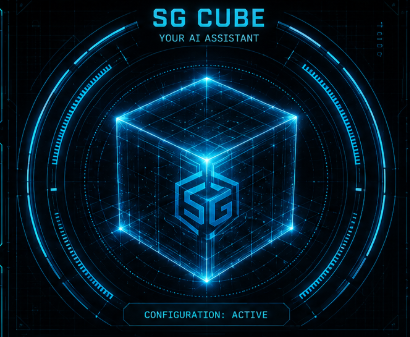
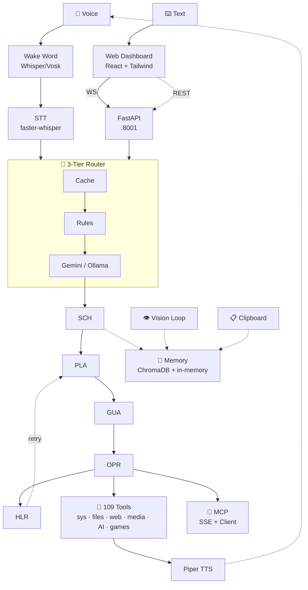
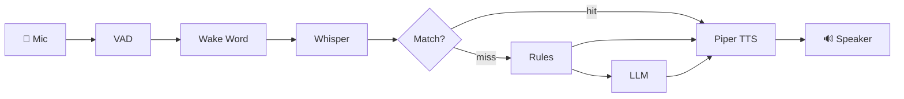
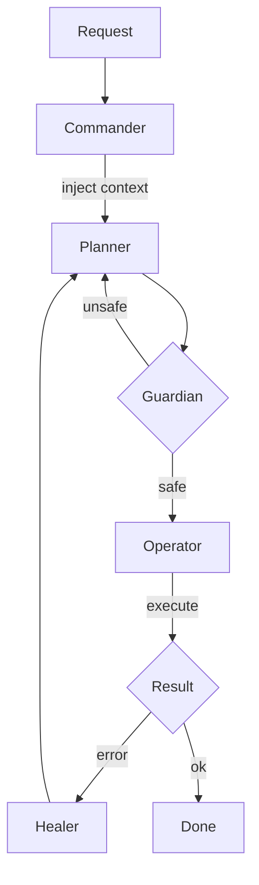

<p align="center">
  
</p>

<h3 align="center"><i>local-first · voice-first · vision-aware</i></h3>

<p align="center">
  <b>An AI assistant that sees your screen, hears your voice, remembers what happened,<br/>
  and acts on it — cloud agent, with voice, vision and memory kept on the machine.</b>
</p>

<p align="center">
  <sub>
    <b>1,071 tests passing</b> &nbsp;·&nbsp;
    109 tools &nbsp;·&nbsp;
    5-stage agent pipeline &nbsp;·&nbsp;
    MCP server + client &nbsp;·&nbsp;
    Python 3.12 · FastAPI · React 18 · three.js
  </sub>
</p>

---

<!--  SCREENSHOT 1 of 4 — MAIN DASHBOARD.  Capture the whole window, backend running
      so the panels hold live values (not zeros/placeholders). Save as
      docs/screenshots/dashboard.png, then delete these comment markers.

<p align="center">
  
</p>
<p align="center">
  <sub><b>SG-CUBE Command Center</b> — live view of the AI core, memory, voice,
  architecture and system telemetry, streamed over WebSocket.</sub>
</p>
-->

## ▸ What it is

SG-CUBE is a desktop AI assistant built around one idea: **the assistant should do things, not
just say things.** You speak to it, it can look at your screen, it remembers the conversation
across sessions, and it executes real actions through a registry of 109 tools — files, shell,
browser, media, OCR, reminders, notes, even a few games.

The agent model runs in the cloud (Gemini 2.5 Flash, with a local Ollama fallback). Everything
that would be uncomfortable to stream — **your microphone, your screen, your memory** — is
processed locally by Vosk, faster-whisper, Piper, Qwen2.5-VL and ChromaDB.

## ▸ Why I built it

Most assistant projects stop at "wrap an API in a chat box". The interesting problems are the
ones that only show up afterwards: what happens when the model hallucinates a plan, when the
user interrupts mid-sentence, when the network dies halfway through a turn, when a rule fires on
a mistranscription and takes the *wrong* action silently.

SG-CUBE is where I work on those. A good chunk of this repo is not features — it's routing,
guardrails, recovery, telemetry and tests around the features.

---

## ▸ System architecture


```mermaid
flowchart TB
    V["🎤 Voice"] --> WW["Wake Word\nWhisper/Vosk"]
    WW --> STT["STT\nfaster-whisper"]
    STT --> ROUTER

    T["⌨️ Text"] --> UI["Web Dashboard\nReact + Tailwind"]
    UI -->|WS| API["FastAPI\n:8001"]
    UI -.->|REST| API
    API --> ROUTER

    subgraph ROUTER["🔀 3-Tier Router"]
        direction LR
        CACHE[Cache] --> RULE[Rules] --> LLM[Gemini / Ollama]
    end

    LLM --> SCH --> PLA --> GUA --> OPR --> HLR
    HLR -.->|retry| PLA

    OPR --> TOOLS["🔧 109 Tools\nsys · files · web · media · AI · games"]
    OPR --> MCP["🔌 MCP\nSSE + Client"]
    TOOLS --> TTS["Piper TTS"] -.-> V

    SCH -.-> MEM["💾 Memory\nChromaDB + in-memory"]
    VL["👁️ Vision Loop"] -.-> MEM
    CLIP["📋 Clipboard"] -.-> MEM
```

### How a request flows


```mermaid
flowchart LR
    MIC[🎤 Mic] --> VAD[VAD] --> WW[Wake Word] --> STT[Whisper]
    STT --> CACHE{Match?}
    CACHE -->|miss| RULE[Rules] --> LLM[LLM]
    CACHE -->|hit| TTS
    RULE --> TTS
    LLM --> TTS
    TTS[Piper TTS] --> SP[🔊 Speaker]
```

**The router is the part worth looking at.** A cache hit or a matched rule (~40 of them) never
reaches the model at all. The LLM is the fallback, not the front door — so common commands stay
fast and, more importantly, stay *deterministic*. A rule that matches cannot be talked out of its
behaviour by a hallucinated plan.

### The agent pipeline


```mermaid
flowchart TB
    REQ[Request] --> CMD[Commander] -->|inject context| PLA[Planner]
    PLA --> GUA{Guardian}
    GUA -->|unsafe| PLA
    GUA -->|safe| OPR[Operator]
    OPR -->|execute| RES{Result}
    RES -->|error| HLR[Healer] --> PLA
    RES -->|ok| DONE[Done]
```

Guardian sits between planning and execution, and can bounce a plan back before anything runs.
Healer catches execution failures and re-plans instead of surfacing a stack trace.

<!--  SCREENSHOT 2 of 4 — AGENT PIPELINE.  ArchitecturePanel / ArchitectureMapOverlay,
      captured mid-request so the stages are lit rather than idle. This is the shot that
      says "not a chatbot". Save as docs/screenshots/agents.png.

<p align="center">
  
</p>
<p align="center">
  <sub><b>Agent pipeline in flight</b> — a request moving through
  Commander → Planner → Guardian → Operator → Healer.</sub>
</p>
-->

---

## ▸ Capabilities

| Layer | Stack | Status |
|-------|-------|--------|
| **Wake Word** | Vosk (always-on) / Whisper | ✅ |
| **Speech-to-Text** | faster-whisper + silero-VAD · selectable backend | ✅ |
| **Text-to-Speech** | Piper neural TTS, with barge-in | ✅ |
| **Voice Pipeline** | Local (default) or LiveKit streaming | ✅ |
| **Intent Routing** | 3-tier: Cache → Regex Rules (~40) → LLM | ✅ |
| **Agent LLM** | Gemini 2.5 Flash (cloud) / Ollama (local fallback) | ✅ |
| **Intent Classifier** | Ollama — phi3 (local, lightweight) | ✅ |
| **Vision** | Periodic screen capture + Qwen2.5-VL | ✅ |
| **Memory** | ChromaDB (long-term/episodic) + in-memory (working/timeline/screen) | ✅ |
| **Agent Pipeline** | Commander → Planner → Guardian → Operator → Healer | ✅ |
| **Tool System** | 109 registered tools (system, files, web, media, AI, games) | ✅ |
| **MCP Protocol** | FastMCP SSE server + external MCP client | ✅ |
| **Observability** | Reliability metrics · tool-usage heatmap · agent telemetry | ✅ |
| **Plugins** | Auto-discovered from `backend/plugins/` | ✅ |
| **Auth** | Supabase JWT (optional — local mode works without it) | ✅ |
| **Frontend** | React 18 · TypeScript 5.7 · Vite 6 · Tailwind · three.js / React Three Fiber | ✅ |

> The dashboard gets a live WebSocket feed of agent state, mic levels, routing decisions and
> memory queries — so you can watch *which tier answered* and *why*, per turn.

---

## ▸ Engineering decisions

The decisions I'm most willing to be judged on are the ones where measurement beat intuition.

**I falsified my own migration plan.** The proposal was to drop faster-whisper for cloud STT and
keep offline commands alive by having Vosk feed the rule engine. Probed against a 30-clip
real-voice corpus with the real matcher, Vosk scored **4/30** rule matches against Whisper's
12/30. `"stop"` — the one command that most needs to be instant and offline — transcribed as
`'top'` on every take of both model sizes. The larger 128MB model was *worse and slower*. Plan
discarded on the evidence.

**The first measurement was wrong, and that's recorded too.** The initial probe scored 1/30.
The corpus clips hold two takes each, and concatenating them produced `"what time is it what
time is it"` — which no `^...$`-anchored rule can match even on a perfect transcription. Fixed by
draining the recognizer per utterance and scoring takes separately. The trap is written down so
it doesn't get walked into twice.

**Deleting code is gated, and the gates don't trade against each other.** Latency must beat the
measured 2,614ms cold baseline on median *and* p95; recognition must match or beat Whisper's
12/30; safety allows **zero** wrong rule executions as an automatic fail. A row that cannot be
measured counts as FAIL, not pass-by-default. Standing instruction to myself, carried into the
plan verbatim: *do not optimise the results to justify the migration.*

**Evidence against my own choice stays visible.** Profiling showed `stt_idle_unload_s = 180.0`
is what makes the common case slow — setting it to 0 collapses 2,614ms to ~350ms. One line,
~7.5x, and it beats any network round-trip. That undercuts the migration I'd already committed
to, so it's logged rather than quietly dropped.

<!--  SCREENSHOT 3 of 4 — MEMORY.  MemoryEnginePanel showing a real retrieval — an actual
      remembered item coming back, not an empty store. Save as docs/screenshots/memory.png.

<p align="center">
  
</p>
<p align="center">
  <sub><b>Memory engine</b> — ChromaDB long-term recall surfacing prior context,
  alongside the in-memory working/timeline stores.</sub>
</p>
-->

<!--  SCREENSHOT 4 of 4 — VOICE.  LiveTranscriptionPanel + VoiceModulePanel mid-utterance,
      with the transcript populated and the routing tier visible. Save as
      docs/screenshots/voice.png.

      NOTE: there is no dedicated Vision panel in the frontend today — vision surfaces
      through Architecture/ModuleStatus. So this slot is voice, not vision.

<p align="center">
  
</p>
<p align="center">
  <sub><b>Voice pipeline</b> — live transcription, and which of the three routing
  tiers answered the turn.</sub>
</p>
-->

---

## ▸ Tech stack

| | |
|---|---|
| **Core** | Python 3.12 · FastAPI · Pydantic-settings · asyncio |
| **Agent** | Gemini 2.5 Flash · Ollama (phi3) · custom 5-stage pipeline |
| **Voice** | Vosk · faster-whisper · silero-VAD · Piper · LiveKit (optional) |
| **Vision** | Qwen2.5-VL · Tesseract OCR |
| **Memory** | ChromaDB · nomic-embed-text |
| **Protocol** | FastMCP (SSE server + client) |
| **Frontend** | React 18 · TypeScript 5.7 · Vite 6 · Tailwind · lucide-react |
| **3D / WebGL** | three.js · React Three Fiber · drei · postprocessing |
| **Data** | Supabase (optional) · SQLite |
| **Testing** | pytest — 1,071 tests |

---

## ▸ Quick start

### Prerequisites

| Tool | Link |
|------|------|
| **Python 3.12+** | [python.org](https://python.org) |
| **Ollama** | [ollama.com](https://ollama.com) |
| **Tesseract OCR** | [UB-Mannheim/tesseract](https://github.com/UB-Mannheim/tesseract/wiki) |

### Setup

```bash
# 1. Pull local models (intent classifier + embeddings + vision)
ollama pull phi3
ollama pull qwen2.5vl:3b
ollama pull nomic-embed-text

# 2. Python environment
python -m venv .venv
.venv\Scripts\activate
pip install -r requirements.txt

# 3. Download offline voice models
python tools/download_vosk_model.py
python tools/download_piper_voice.py

# 4. Configure
copy .env.example .env
# Set GEMINI_API_KEY in .env (get one at https://aistudio.google.com/apikey)
```

### Run

```bash
# Terminal 1 — Backend (boots API + wake word + vision + clipboard + telemetry + watcher)
python -m uvicorn backend.server.main:app --host 127.0.0.1 --port 8001

# Terminal 2 — Frontend dev server
cd frontend
npm install
npm run dev
```

Open **http://localhost:5173** — API at `http://127.0.0.1:8001`.

> **PowerShell users:** type `.\sg_cube` instead of `sg_cube`.

Every background service is toggleable via `.env` — see **Configuration** below.

### Production build

```bash
cd frontend && npm run build
python -m uvicorn backend.server.main:app --host 0.0.0.0 --port 8001   # auto-serves built frontend
```

---

## ▸ Configuration

| Variable | Default | Purpose |
|----------|---------|---------|
| `APP_HOST` / `APP_PORT` | `127.0.0.1` / `8001` | Web server bind address |
| `GEMINI_API_KEY` | — | Primary cloud LLM key |
| `GEMINI_MODEL` | `gemini-2.5-flash` | Agent model |
| `OPENROUTER_API_KEY` | — | Alternative cloud LLM key |
| `OPENROUTER_MODEL` | `deepseek/deepseek-chat` | Model used when OpenRouter key is set |
| `OLLAMA_MODEL` | `phi3` | Local intent classifier (lightweight) |
| `STT_BACKEND` | `whisper` | Speech-to-text backend |
| `WHISPER_MODEL` | `base` | STT model size (tiny/base/small) |
| `VOICE_PIPELINE` | `local` | `local` or `livekit` |
| `ENABLE_VISION` | `true` | Passive screen glance every 5 min (fills memory) |
| `ENABLE_WAKE_WORD` | `true` | Mic listener for the wake phrase |
| `ENABLE_CLIPBOARD` | `true` | Clipboard change tracking |
| `ENABLE_TELEMETRY` | `true` | CPU/mem/disk broadcast to UI |
| `ENABLE_WATCHER` | `true` | Proactive agent triggers (battery, folder watches) |
| `WAKE_PHRASE` | `onyx` | Word that wakes the assistant |
| `WAKE_DEVICE` | — | Mic device index (blank = system default) |

Set `ENABLE_VISION=false` to skip passive screen glances — the on-demand `describe_screen` tool
still captures fresh. Set `ENABLE_WAKE_WORD=false` on headless / no-mic machines.

---

## ▸ Project map

```text
backend/
├── daemon/           # Background services (booted from server/main.py's lifespan)
│   ├── trigger.py    # Wake word → STT → Router → Execute → TTS
│   ├── wake_word.py  # Vosk/Whisper listener
│   ├── vision_loop.py
│   ├── clipboard_watcher.py
│   └── telemetry.py
├── server/           # FastAPI application
│   ├── main.py       # App definition + route mounting
│   ├── config.py     # Pydantic-settings
│   ├── ws_ui.py      # WebSocket manager
│   └── routes/       # admin, agents, auth, execute, files,
│                     # memory, orchestrate, system, vision, voice
├── core/             # Intelligence layer
│   ├── agents/       # Commander, Planner, Guardian, Operator, Watcher
│   ├── tools/        # 109 tools + registry + builtins (+ 6 games)
│   ├── memory/       # ChromaDB, episodic, timeline, working, screen
│   ├── orchestrator/ # Cache → Rules → LLM router
│   ├── mcp_server.py # MCP protocol (SSE + client)
│   └── plugins/      # User plugins (auto-discovered)
├── ai_modules/       # LLM clients, STT, TTS, LiveKit worker
└── database/         # ChromaDB + Supabase + migrations
frontend/
└── src/
    ├── components/   # 13 dashboard panels — AICore, Memory, Voice,
    │                 # Architecture, Confidence, Latency, Telemetry,
    │                 # LiveTranscription + CubeVisualization (three.js)
    ├── hooks/        # useUiEvents — live WebSocket event stream
    └── lib/          # uiEvents, transcriptTurn, cn
tools/                # 30+ scripts (downloads, diagnostics, probes, demos)
tests/                # pytest — 1,071 tests (+ vitest on the frontend)
```

---

## ▸ Testing

```bash
.venv\Scripts\python.exe -m pytest tests -q
```

Use the venv interpreter — it is the only one with `cv2` + `ultralytics`, which the vision tests
need.

```
1071 passed, 3 deselected in 119.46s
```

| Phase | Feature | Status |
|-------|---------|--------|
| **A** | Tool registry bootstrap | ✅ |
| **B** | Plugin auto-discovery | ✅ |
| **C1–C2** | Streaming ASR + TTS + interrupt | ✅ |
| **C3** | LiveKit optional pipeline | ✅ |
| **D** | 3-tier routing (Cache → Rules → LLM) | ✅ |
| **E** | MCP protocol integration | ✅ |
| **F** | 6 CLI games + personality | ✅ |
| **G** | Observability + dev docs | ✅ |

---

## ▸ Roadmap

- **STT backend migration** — `STT_BACKEND` is now selectable; the Whisper → Gemini switch is
  gated on latency, recognition and safety criteria that have not yet been run live
- **Spoken failure modes** — the assistant now says *why* recognition failed instead of going quiet
- **Vision memory** — richer screen-history retrieval

---

<p align="center">
  <sub>agent model via Gemini — voice, vision &amp; memory stay local</sub>
</p>
